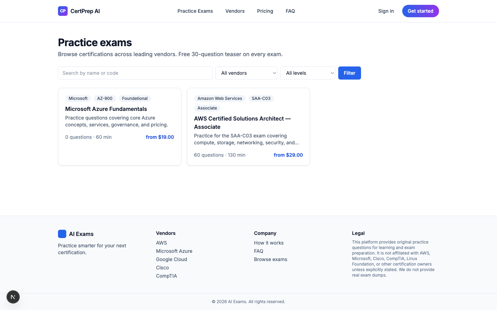
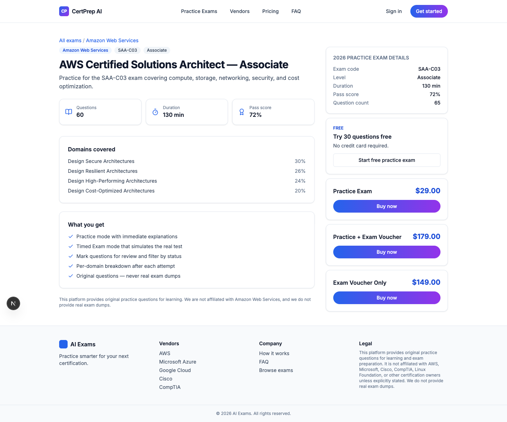

<div align="center">

# CertPrep AI

[](https://nextjs.org/)
[](https://www.typescriptlang.org/)
[](https://www.prisma.io/)
[](https://www.postgresql.org/)
[](https://tailwindcss.com/)
[](https://authjs.dev/)
[](https://docs.anthropic.com/)
[](https://developer.paypal.com/)
[](https://www.docker.com/)
[](https://coolify.io/)
[](#license)

**Modern multi-vendor certification practice exam platform — AI-curated questions, two exam modes, PayPal checkout, and a Coolify-ready Docker stack.**

[Demo](https://ai-exams.tertiaryinfo.tech) · [Report Bug](https://github.com/alfredang/ai-exams/issues) · [Request Feature](https://github.com/alfredang/ai-exams/issues)

</div>

## Screenshot


<details>
<summary>More screenshots</summary>

**Practice exam catalog**


**Exam detail with tier pricing**


</details>

## About

CertPrep AI is a production-ready web application for selling and delivering practice exams across industry certifications (AWS, Microsoft Azure / 365, Cisco CCNA, CompTIA, Google Cloud, Linux Foundation, Anthropic, and more). Candidates browse a catalog, try a free 30-question teaser on any exam, then purchase access in three tiers — practice only, practice + voucher, or voucher only. Admins build the question bank manually or by streaming generation through the Claude Agent SDK.

### Key features

| Area | Highlights |
|------|-----------|
| **Catalog** | `/practice-exams` with vendor + level + search filters, vendor-scoped landing pages, detail pages with 3-tier pricing |
| **Exam runtime** | One unified runner for **Practice** (immediate explanations) and **Exam** (timed, server-enforced) modes — autosave every 15s, refresh-safe resume |
| **Free teaser** | 30 questions per exam, gate at Q20 + Q30 capturing email → OTP → seamless guest-to-user migration |
| **Auth** | Email + password **and** email + 6-digit OTP via Auth.js v5; 30-day rolling JWT |
| **Payments** | PayPal Smart Buttons + REST Orders v2 + signature-verified webhook backup; idempotent fulfillment writes `Entitlement` rows and a downloadable PDF voucher |
| **AI generation** | Admin streams questions live from Claude using a `submit_question` tool, validates with Zod, persists as `DRAFT` for per-row approve/discard |
| **Admin** | Vendors, exams, questions (DRAFT → PUBLISHED → ARCHIVED), users with manual exam grants, orders with refund stub |
| **Compliance** | Original questions only — never real exam dumps. Disclaimer baked into footer, exam pages, and the AI generator system prompt |

## Tech Stack

| Category | Stack |
|----------|-------|
| **Framework** | Next.js 15 (App Router) + TypeScript (strict) |
| **Styling** | Tailwind CSS 3, lucide-react, Radix primitives |
| **Database** | PostgreSQL 16 + Prisma 6 |
| **Auth** | Auth.js (NextAuth v5) — Credentials providers (password + OTP), edge-safe split config |
| **Payments** | `@paypal/react-paypal-js` (client) + REST Orders v2 (server) + webhook signature verification |
| **AI / LLM** | `@anthropic-ai/claude-agent-sdk` with tool use + SSE streaming |
| **PDF** | `pdf-lib` for voucher generation |
| **Email** | `nodemailer` (SMTP); MailHog for local dev |
| **Validation** | Zod everywhere |
| **Hashing** | argon2id (OWASP-recommended) |
| **Deployment** | Multi-stage Dockerfile + docker-compose, Coolify-ready |

## Architecture

```
┌──────────────────────────────────────────────────────────────────────┐
│                      Browser (React Client)                           │
│   Hero · Catalog · Exam Runner · Teaser Gate · Admin SSE Viewer       │
└─────────────┬──────────────────────────────┬─────────────────────────┘
              │                              │ SSE (admin generator)
              │ App Router routes            │
┌─────────────▼──────────────────────────────▼─────────────────────────┐
│                       Next.js 15 (App Router)                         │
│  ┌──────────────┐   ┌──────────────┐   ┌──────────────────────────┐  │
│  │  Server      │   │  Route       │   │  Middleware              │  │
│  │  Components  │   │  Handlers    │   │  (edge-safe Auth.js)     │  │
│  │  + Actions   │   │              │   │  RBAC: /admin /my-content│  │
│  └──────┬───────┘   └──────┬───────┘   └──────────────────────────┘  │
└─────────┼──────────────────┼──────────────────────────────────────────┘
          │                  │
          │  Prisma          │  REST/Webhook                External
          ▼                  ▼                              Services
┌─────────────────┐  ┌──────────────────┐  ┌──────────────────────────┐
│  PostgreSQL 16  │  │  PayPal Orders v2│  │  Claude Agent SDK         │
│  • User         │  │  + Webhooks      │  │  (submit_question tool)   │
│  • Exam/Question│  │                  │  └──────────────────────────┘
│  • Attempt JSON │  └──────────────────┘  ┌──────────────────────────┐
│  • Entitlement  │  ┌──────────────────┐  │  SMTP (nodemailer)        │
│  • OtpCode      │  │  pdf-lib voucher │  │  • OTP codes              │
│  • Order/Log    │  │  generator       │  │  • Order confirmations    │
└─────────────────┘  └──────────────────┘  └──────────────────────────┘
```

## Project Structure

```
ai-exams/
├── prisma/
│   ├── schema.prisma                # Postgres schema (Entitlement, Attempt JSON, OtpCode…)
│   └── seed.ts                      # admin + 3 vendors + 2 exams + 60 questions
├── src/
│   ├── app/
│   │   ├── page.tsx                 # gradient hero
│   │   ├── practice-exams/          # catalog → vendor → detail → teaser
│   │   ├── login/, signup/          # two-card layout, password + OTP tabs
│   │   ├── verify-otp/, forgot-password/
│   │   ├── exam/[attemptId]/        # unified Practice / Exam runner
│   │   ├── results/[attemptId]/     # per-domain breakdown + review
│   │   ├── checkout/[examId]/       # ?tier=PRACTICE|BUNDLE|VOUCHER
│   │   ├── my-content/              # user dashboard
│   │   ├── admin/                   # role-gated console
│   │   └── api/
│   │       ├── auth/[...nextauth]/  # Auth.js handler
│   │       ├── otp/{request,verify}/
│   │       ├── attempts/{start,answer,autosave,mark,submit}/
│   │       ├── paypal/{create-order,capture,webhook}/
│   │       ├── admin/generate-questions/   # SSE streaming
│   │       └── vouchers/[id]/pdf/
│   ├── components/                  # nav, footer, exam-runner, teaser-gate, dot-pattern
│   └── lib/                         # auth, claude, fulfill, paypal, mail, voucher-pdf, …
├── Dockerfile                       # multi-stage standalone build
├── docker-compose.yml               # postgres (host :55432) + mailhog + app
├── .env.example
├── CLAUDE.md                        # architecture notes for AI assistants
└── README.md
```

## Getting Started

### Prerequisites

- Node.js 20+
- Docker (for Postgres + MailHog)
- A PayPal sandbox app (optional — required for checkout flows)
- An Anthropic API key (optional — required for AI question generation)

### 1. Clone and install

```bash
git clone https://github.com/alfredang/ai-exams.git
cd ai-exams
npm install --legacy-peer-deps
```

> `--legacy-peer-deps` is required because `next-auth@5.0.0-beta.25` and a few Radix peers don't yet declare React 19 in their peer ranges.

### 2. Environment

```bash
cp .env.example .env
# edit .env — DATABASE_URL is preconfigured for the docker-compose Postgres on host port 55432
```

### 3. Boot infra and seed

```bash
docker compose up -d postgres mailhog
npx prisma migrate dev --name init
npm run db:seed     # admin + 3 vendors + AWS SAA-C03 (60q, 30 teaser) + Azure AZ-900
```

### 4. Run

```bash
npm run dev -- -p 3040 -H 127.0.0.1
```

- App → <http://127.0.0.1:3040>
- MailHog (catches OTP + purchase emails) → <http://127.0.0.1:8025>
- Admin login → `ADMIN_EMAIL` / `ADMIN_PASSWORD` from `.env` (defaults: `admin@example.com` / `ChangeMe!2026`)

> **Postgres host port is 55432, not 5432**, to avoid colliding with a system Postgres. Keep `DATABASE_URL` and `docker-compose.yml` in sync.

### Useful scripts

| Script | What it does |
|--------|--------------|
| `npm run dev` | Next dev server |
| `npm run build` | `prisma generate && next build` |
| `npm run typecheck` | `tsc --noEmit` |
| `npm run lint` | Next ESLint |
| `npm run db:migrate` | Prisma migrate dev |
| `npm run db:deploy` | Prisma migrate deploy (prod) |
| `npm run db:seed` | Run `prisma/seed.ts` |
| `npm run db:studio` | Prisma Studio UI |

## Deployment

### Docker (local production build)

```bash
docker compose up --build
```

### Coolify (recommended)

1. Point Coolify at this repo. The included [Dockerfile](Dockerfile) is auto-detected (multi-stage, Next.js standalone output, runs `prisma migrate deploy` before `node server.js`).
2. Provision a Postgres service via Coolify's Services panel.
3. Set environment variables (see `.env.example`):
   - `DATABASE_URL`
   - `NEXTAUTH_SECRET` (generate via `openssl rand -base64 32`)
   - `NEXTAUTH_URL` and `APP_URL` (e.g. `https://ai-exams.tertiaryinfo.tech`)
   - `PAYPAL_CLIENT_ID`, `PAYPAL_CLIENT_SECRET`, `PAYPAL_WEBHOOK_ID`, `PAYPAL_ENV`
   - `NEXT_PUBLIC_PAYPAL_CLIENT_ID`
   - `SMTP_HOST`, `SMTP_PORT`, `SMTP_USER`, `SMTP_PASSWORD`, `SMTP_FROM`
   - `ANTHROPIC_API_KEY`
   - `ADMIN_EMAIL`, `ADMIN_PASSWORD`
4. Expose port `3000`. Configure your domain + TLS in Coolify.
5. After first deploy: `docker exec <container> npm run db:seed`.

### PayPal webhook

Create a webhook for `PAYMENT.CAPTURE.COMPLETED` (and optionally `CHECKOUT.ORDER.APPROVED`) pointing at:

```
https://<your-domain>/api/paypal/webhook
```

Copy the Webhook ID into `PAYPAL_WEBHOOK_ID`. The capture endpoint also fulfills inline; the webhook is an idempotent backup for closed-tab cases.

## Compliance

> This platform provides **original** practice questions for learning and exam preparation. It is not affiliated with AWS, Microsoft, Cisco, CompTIA, Linux Foundation, or other certification owners unless explicitly stated. **We do not provide real exam dumps.** The Claude Agent SDK system prompt explicitly forbids real-exam claims and requires reference URLs in every generated question.

## Contributing

Contributions are welcome. To propose a change:

1. Fork the repo
2. Create a feature branch (`git checkout -b feat/your-feature`)
3. Make your changes — keep type-check + build clean (`npm run typecheck && npm run build`)
4. Commit with conventional-style messages
5. Open a Pull Request

For larger changes, please open an issue first to discuss the approach.

## Developed By

**Tertiary Infotech Academy Pte. Ltd.**

## Acknowledgements

- Visual reference: [certificationpractice.com](https://certificationpractice.com/) — clean white-minimalist certification-training aesthetic
- [Next.js](https://nextjs.org/) and the App Router
- [Prisma](https://www.prisma.io/) for the ORM
- [Auth.js](https://authjs.dev/) for the auth primitives
- [Anthropic](https://www.anthropic.com/) for the Claude Agent SDK
- [PayPal Developer](https://developer.paypal.com/) for sandbox/live REST APIs
- [Coolify](https://coolify.io/) for the self-hosted PaaS

## License

MIT — see [LICENSE](LICENSE) if present, otherwise treat as MIT-licensed for now.

---

⭐ **If you find this useful, please consider starring the repo.**
