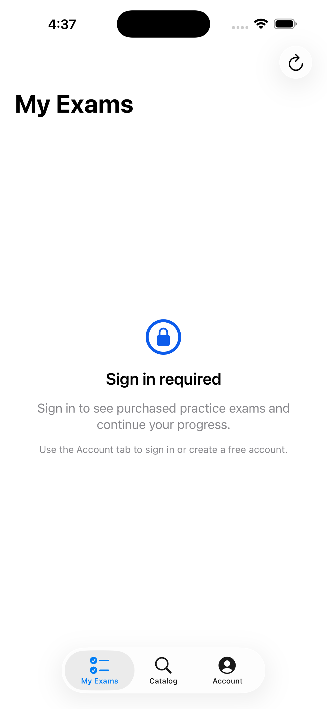

# AI Exams iOS

Native SwiftUI client for Tertiary Exams mobile practice.

<a href="https://apps.apple.com/us/app/tertiary-ai-exams/id6781995308">
  
</a>

**Now live on the App Store** → [Tertiary AI Exams](https://apps.apple.com/us/app/tertiary-ai-exams/id6781995308)

<p>
  
</p>

## Scope

- Register and sign in with email/password.
- Browse the public exam catalog without checkout or payment actions.
- View purchased practice exams from the user's existing entitlements.
- Start free teasers from catalog entries.
- Start purchased exams in Practice mode or Exam mode.
- Save answers, reveal explanations in Practice mode, and submit for scoring.

## Build

The Xcode project is generated with XcodeGen:

```sh
xcodegen generate
xcodebuild -project AIExams.xcodeproj -scheme AIExams -destination 'generic/platform=iOS Simulator' build CODE_SIGNING_ALLOWED=NO
```

### Install on a connected iPhone

```sh
xcodebuild -project AIExams.xcodeproj -scheme AIExams -configuration Debug \
  -destination 'id=<device-udid>' -allowProvisioningUpdates -derivedDataPath build
xcrun devicectl device install app --device <device-udid> \
  build/Build/Products/Debug-iphoneos/AIExams.app
```

The app points at `https://exams.tertiaryinfotech.com` by default in `AIExams/Services/APIClient.swift`.
