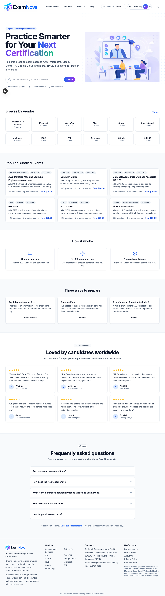

<div align="center">

# ExamNova

[](https://nextjs.org/)
[](https://www.typescriptlang.org/)
[](https://www.prisma.io/)
[](https://www.postgresql.org/)
[](https://tailwindcss.com/)
[](https://authjs.dev/)

Practice smarter for your next certification. End-to-end e-commerce admin + AI-assisted question authoring on Next.js 15.

</div>

---

## Screenshot



---

## What it does

ExamNova is a full-stack practice-exam platform with a production-grade admin backend:

- **Customer surface** — vendor catalog, free teaser, **bundle-only purchases** (multiple practice exams + optional real-exam voucher, sold together — no per-exam SKUs), multi-provider checkout (PayPal · HitPay · PayNow), invoices.
- **Admin backend** — compact dashboard with KPI cards, drill-down reports, RBAC, audit log, notifications bell, ⌘K global search.
- **AI-assisted authoring** — four modes to create exam questions (Manual · Blueprint · PDF · Web-scrape) using Claude Agent SDK + Firecrawl.
- **Money layer** — sequential invoice + order numbering, tax (GST) engine, multi-currency display, refunds with provider APIs + auto credit-note minting, coupon engine.
- **Operations** — voucher inventory (CSV bulk upload, FIFO claim), webhook event log, GDPR data export, API tokens for partners, cron workers (delivery, expiry, scheduled reports).

## Quick start

```bash
docker compose up -d postgres mailhog     # Postgres on :55432, MailHog on :8025
npm install --legacy-peer-deps
cp .env.example .env                       # set DATABASE_URL host port to 55432
npx prisma migrate dev --name init
npm run db:seed                            # admin + sample exams
npm run dev -- -p 3040 -H 127.0.0.1
```

## Key routes

### Public marketing
- `/` — homepage with hero, vendor grid, popular bundles, FAQ
- `/practice-exams` — bundle catalog (vendors, levels, search, pagination — auto-filters on vendor/level change)
- `/practice-exams/[vendor]/[slug]` — **bundle detail** with per-domain blueprint + PRACTICE / PRACTICE+VOUCHER prices (bundles are the only thing you can buy)
- `/practice-exams/[vendor]/[slug]/teaser` — free practice teaser (count configurable via admin)
- `/exam/[attemptId]` — unified runner for Practice + Exam modes (questions always shuffled)
- `/results/[attemptId]` — per-domain breakdown + review
- `/checkout/[bundleId]?tier=PRACTICE|VOUCHER` — checkout with PayPal · HitPay · PayNow + promo code input
- `/sitemap.xml` — auto-generated from published bundles + pages

### Authenticated user
- `/user-dashboard` — overview · exams · attempts · orders · invoices · vouchers · settings (theme picker)

### Admin (`/admin-dashboard`)
- **Overview** — KPI dashboard (revenue today/7d/30d/MTD · refund rate · signups · active learners · tax MTD)
- **Catalog** — Vendors · Exams (questions live here, but exams are not directly sold) · **Bundles** (the unit of sale — group multiple practice exams ± a real-exam voucher into one product, set bundle price + optional voucher price)
- **Money** — Orders · Invoices · Vouchers (Deliveries + Inventory) · Coupons · Webhook Events
- **Reports** — Revenue · Tax (GST) · Exam analytics — all with date-range pickers + CSV exports
- **People** — Users (detail tabs, tags, notes, impersonate, GDPR export) · Admins
- **Content** — Email Templates · Pages · FAQ · Banners
- **System** — Notifications · Logs (Email + Audit) · API Tokens · Settings · Site SEO

## Four ways to author questions

After creating an exam, the **Author questions** chooser at `/admin-dashboard/exams/[id]/author` offers four modes:

1. **Manual** — type 5 questions at a time with per-answer explanations
2. **AI Assist (Blueprint)** — auto-generate the full exam (e.g. 60 questions) where domain distribution matches the published blueprint percentages. Uses Firecrawl to scrape the official exam objectives, then Claude generates questions per domain quota.
3. **From PDF / e-book** — upload a vendor study guide; pdf-parse extracts text, Claude grounds questions in it.
4. **From web pages (Firecrawl + Claude)** — paste URLs, Firecrawl scrapes to markdown, Claude authors questions.

Approve/Discard each generated question before it lands in the bank.

## Architecture

Single Next.js 15 (App Router) app — server actions, edge-safe middleware split, SSE streaming for AI generation.

- **Auth** — Auth.js v5 with three providers: password (argon2id), OTP, Google + GitHub OAuth (configurable from admin Settings → Social Login)
- **DB** — Prisma + Postgres (`models`: User, Exam, Vendor, Question, Bundle, Order, Invoice, Refund, Coupon, Entitlement, VoucherInventory, VoucherDelivery, EmailLog, AdminLog, AdminNotification, ApiToken, …)
- **Payments** — PayPal Orders v2, HitPay, PayNow (manual SGQR + admin confirm); all webhooks log to `PaymentWebhookEvent` first to preserve payloads
- **PDF** — `pdf-lib` for invoice + voucher rendering (shared layout helpers in `src/lib/pdf/layout.ts`)
- **AI** — `@anthropic-ai/claude-agent-sdk` for streaming generation; Firecrawl for web scraping
- **Email** — Nodemailer with Gmail OAuth (preferred) or SMTP transport; every send logged to `EmailLog`
- **Cron** — three worker routes auth'd via `WORKER_SHARED_SECRET`: `/api/worker/voucher-delivery`, `/api/worker/voucher-expiry`, `/api/worker/reports`

## Configurable from admin Settings

No hardcoded constants — everything below is editable at runtime under `/admin-dashboard/settings`:

| Group | Keys |
|---|---|
| Company Info | name, short name, UEN, address, website, email, tel |
| Branding | brand name, logo URL, primary color, support email |
| Site SEO | home title, description, keywords |
| Tax & Invoice | TAX_ENABLED, TAX_RATE_BPS, TAX_LABEL, TAX_INCLUSIVE, COMPANY_GST_REG, INVOICE_PREFIX, FX_TO_SGD_*_BPS |
| Payment | PayPal · HitPay · PayNow credentials + enabled flags, voucher delay days, fulfilment TZ, **free teaser question count** |
| Email | EMAIL_TRANSPORT (Gmail OAuth · SMTP), credentials, EMAIL_FROM |
| Social Login | Google + GitHub OAuth client IDs + secrets |
| Credentials | Anthropic, Firecrawl, Tavily, worker shared secret |

## Claude skills + agents

Project-level [.claude/skills/](.claude/skills/) and [.claude/agents/](.claude/agents/):

- `custom-practice-exam` — generate one full blueprint-aligned exam
- `seo-audit` — audit and improve marketing-page SEO
- `exam-batch-generator` (agent) — generate practice exams for many certifications in parallel using the skill above

## Repo layout

```
prisma/
  schema.prisma                # full data model (25+ models)
  migrations/                  # all reversible Prisma migrations
src/
  app/
    admin-dashboard/           # admin backend — see route list above
    practice-exams/            # public catalog + detail + teaser
    user-dashboard/            # authenticated user surface
    checkout/, exam/, results/ # purchase + practice runner + results
    api/
      admin/                   # admin-only endpoints (gated)
      worker/                  # cron-triggered jobs
      paypal/, hitpay/, paynow/ # payment webhooks + capture
    sitemap.xml/, icon.svg     # SEO + favicon
  components/
    admin/                     # dense data-table, pager, filter-bar, badge, cmdk, …
    checkout/                  # billing card, paynow modal, promo code
  lib/
    analytics.ts               # revenue, tax, exam, cohort, per-question stats
    invoice/                   # issue + render-invoice-pdf + build-lines
    payments/                  # refund, hitpay, webhook-log
    sources/                   # PDF + URL extraction + chunking
    claude.ts                  # Claude streaming question generator
    coupons.ts, numbering.ts, permissions.ts, voucher-inventory.ts,
    api-tokens.ts, admin-notifications.ts, seo-assist.ts, …
.claude/
  skills/                      # project skills (committed)
  agents/                      # batch automation agents (committed)
```

## Testing

There is no automated test runner. Manual verification flows:

- Local dev server `npm run dev -- -p 3040 -H 127.0.0.1`
- Playwright MCP for E2E smoke (homepage / catalog / exam detail / sitemap / login)
- Mailhog at `http://127.0.0.1:8025` for outbound emails
- Stripe / PayPal sandbox for payment flows

## Deploy

Coolify-ready via [Dockerfile](Dockerfile) (multi-stage, Next standalone). Container runs `prisma migrate deploy` before `node server.js`. Set `NEXTAUTH_URL`, `DATABASE_URL`, and the worker secret as env vars; all other configuration is admin-managed.

---

© Tertiary Infotech Academy Pte Ltd
