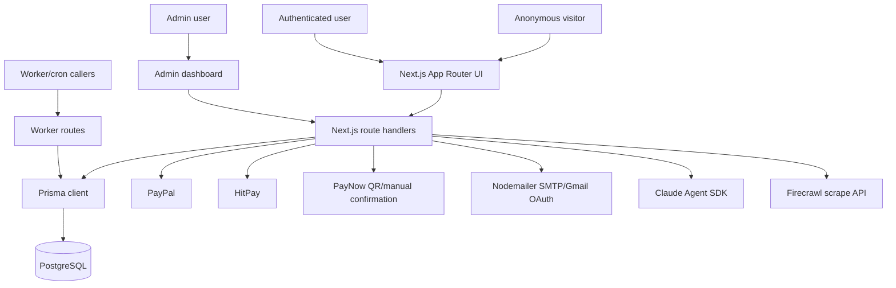
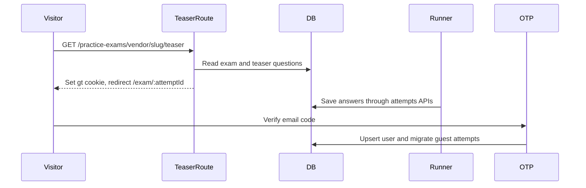
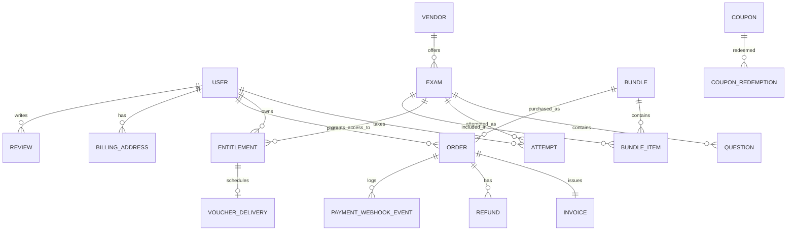

# Product Requirements Document

## 1. Document Metadata

| Field | Value |
|---|---|
| Product name | ExamNova |
| Repository/project name | `ai-exams` |
| PRD version | 0.1, generated from code |
| Generated from | Local repository at `c:\Users\Jared\Downloads\github\ai-exams` |
| Date | 2026-05-18 |
| Target audience | Product manager, software engineer, technical reviewer, security reviewer, stakeholder |
| Confidence summary | High for implemented routes, models, and core flows; Medium for business intent; Low for market strategy, compliance obligations, and roadmap priorities |
| Main evidence sources | `README.md`, `CLAUDE.md`, `package.json`, `prisma/schema.prisma`, `src/app`, `src/lib`, `src/components`, `Dockerfile`, `docker-compose.yml`, `.env.example` |

This PRD is evidence-grounded in the codebase. Recommendations and inferred intent are explicitly labeled. No secret values are repeated.

## 2. Executive Summary

### Confirmed from code

ExamNova is a full-stack certification practice-exam platform that lets visitors browse exam bundles, try teaser attempts, sign up or sign in, purchase bundle-based practice access or voucher tiers, take timed or practice-mode exams, view results, and manage owned exams, orders, invoices, and vouchers.

The system includes a large admin backend for catalog management, AI-assisted question generation, orders, invoices, refunds, voucher delivery, coupons, users, pages, FAQ, banners, reviews, testimonials, settings, logs, reports, and API tokens.

### Inferred from code

The product appears designed for a commercial training or certification-preparation provider that sells original practice content and, optionally, real exam voucher fulfillment.

### Not evident from code

Market positioning, formal business objectives, target revenue metrics, accessibility standard targets, compliance certifications, SLA commitments, customer support policies, and data retention policies are not evident from the provided code.

## 3. Source Coverage and Evidence Base

| Source area | Files/folders reviewed | Purpose | Confidence | Notes |
|---|---|---|---|---|
| Entry points | `src/app/layout.tsx`, `src/app/page.tsx`, `src/proxy.ts`, `next.config.mjs` | App shell, homepage, middleware/proxy, build mode | High | `src/proxy.ts` replaces classic `middleware.ts` naming in this repo |
| Routes/controllers | `src/app/api/**/route.ts`, route index generated from filesystem | API behavior and access checks | High for indexed routes, Medium for routes not line-by-line reviewed |
| Services/business logic | `src/lib/attempts.ts`, `fulfill.ts`, `settings.ts`, `mail.ts`, `coupons.ts`, `claude.ts`, `payments/*`, `invoice/*`, `my-exams.ts` | Core domain logic | High |
| Models/schemas/migrations | `prisma/schema.prisma`, `prisma/migrations`, `prisma/seed.ts` | Data model and seed behavior | High for schema, Medium for all bulk seed content |
| Frontend pages/components | `src/app/**/page.tsx`, `src/components/**`, representative checkout/admin/user/exam components | UI flows | Medium-High |
| Auth/security | `src/lib/auth.ts`, `auth.config.ts`, `otp.ts`, `ratelimit.ts`, `permissions.ts`, `proxy.ts` | AuthN/AuthZ, roles, OTP | High |
| Tests | `package.json`, first-party source search | Test coverage | High | No automated first-party test runner evident; `admin-dashboard/exams/[id]/test/page.tsx` is a manual/admin test page, not an automated test |
| Configuration/deployment | `Dockerfile`, `docker-compose.yml`, `.env.example`, `.gitignore`, `tsconfig.json`, `tailwind.config.ts` | Local/dev/prod assumptions | High |
| Documentation | `README.md`, `CLAUDE.md`, `.claude/**` | Product and developer intent | Medium | Some docs conflict with code versions and routes |

Coverage limitation: this PRD maps all pages and API endpoints but does not line-by-line inspect every large seed script under `scripts/`. Feature claims rely on reviewed core services, schema, route inventory, and representative pages.

## 4. Repository and Architecture Overview

| Item | Evidence |
|---|---|
| Application type | Full-stack web application |
| Languages | TypeScript, TSX, SQL migrations |
| Frameworks | Next.js App Router, React, Prisma, Auth.js, Tailwind CSS |
| Runtime | Node.js, Next standalone output, Docker Node 24 Alpine image |
| Package manager | npm with `package-lock.json`; install notes require `--legacy-peer-deps` |
| Data storage | PostgreSQL via Prisma |
| External services | PayPal, HitPay, PayNow QR, Nodemailer SMTP/Gmail OAuth, Claude Agent SDK, Firecrawl, QR generation |
| Build/run commands | `npm run dev`, `npm run build`, `npm run start`, `npm run db:migrate`, `npm run db:seed`, `npm run typecheck` |

Main directories:

| Directory | Responsibility |
|---|---|
| `src/app` | App Router pages, layouts, route handlers, public/user/admin surfaces |
| `src/components` | Shared React components and dense admin/user/checkout UI |
| `src/lib` | Business logic, integrations, auth, payments, invoice, analytics, settings, AI generation |
| `prisma` | Database schema, migrations, and seed |
| `scripts` | Bulk question seeding, content generation, SEO, logo utilities |
| `.claude` | Project-specific agent and skill instructions |
| `public` | Static images/logos |

## 5. Product Overview

### 5.1 Confirmed Product Behavior

- Browse certification vendors and published bundles through `/`, `/vendors`, `/practice-exams`, `/practice-exams/[vendor]`, and `/practice-exams/[vendor]/[slug]`.
- Start teaser attempts from `/practice-exams/[vendor]/[slug]/teaser`.
- Register, sign in with password, sign in with OTP, and use configurable social login providers.
- Purchase published bundles through `/checkout/bundle/[bundleId]`.
- Pay through PayPal, HitPay, or PayNow when enabled by settings.
- Claim free bundles through `/api/bundles/claim`.
- Take exam attempts in Practice or Exam mode.
- View result breakdowns, explanations, and share pages.
- Manage owned exams, attempts, orders, invoices, vouchers, and profile in `/user-dashboard`.
- Admins can manage catalog, content, money operations, users, settings, reports, logs, reviews, and AI generation in `/admin-dashboard`.

### 5.2 Inferred Product Intent

- Bundle-only commerce is intentional. Evidence: `README.md`, `CLAUDE.md`, `Bundle`/`BundleItem` schema, and checkout routes all use bundles as the purchase target.
- Original practice content and avoidance of exam dumps is intentional. Evidence: homepage copy and `src/lib/claude.ts` generation prompt.
- Runtime admin settings are intended to reduce deployment-time configuration. Evidence: `Setting` table and `src/lib/settings.ts`.

### 5.3 Unknown Product Context

- Business objective and success metrics.
- Target geography beyond Singapore-specific PayNow/GST settings.
- Formal compliance requirements.
- Customer support and refund policies beyond refund implementation.
- Content review standards beyond draft/published status and admin approval.

## 6. Goals and Non-Goals

| Goal / Non-goal | Type | Evidence | Confidence | Notes |
|---|---|---|---|---|
| Sell certification practice exam bundles | Confirmed goal | `Bundle`, checkout pages, payment routes | High | Bundles are the commercial unit |
| Provide free teaser attempts | Confirmed goal | teaser route, `Question.isTeaser`, `TEASER_QUESTION_COUNT` | High | Guest attempts use `gt` cookie |
| Support user practice and timed exam simulation | Confirmed goal | `ExamRunner`, `Attempt.mode`, submit/autosave routes | High | Practice reveals answers; Exam mode timed |
| Provide admin question authoring and generation | Confirmed goal | admin author pages, `generate-*` routes, `claude.ts` | High | Manual, blueprint, PDF, web sources |
| Fulfill vouchers after purchase | Confirmed goal | `VoucherInventory`, `VoucherDelivery`, worker routes, `fulfill.ts` | High | Vouchers are scheduled and emailed later |
| Offer fine-grained non-admin RBAC | Partially implemented goal | `Role` enum and `permissions.ts` | Medium | Proxy/API currently mostly require exact `ADMIN` |
| Support ORDERING/HOTSPOT question interaction | Non-goal/currently unsupported | Schema enum includes values; runner only renders three types | High | Data model is ahead of UI |
| Provide mobile app/native client | Non-goal | No mobile code evident | High | Web only |
| Support automated tests | Non-goal/current gap | No test runner in `package.json` | High | Manual verification documented |

Recommended goals:

- Define security and privacy acceptance gates before production use.
- Add automated test coverage for auth, payments, attempts, and admin mutations.
- Clarify whether `FINANCE`, `SUPPORT`, `CONTENT`, and `READ_ONLY` roles are product requirements.

## 7. Target Users, Actors, and Roles

| Actor / role | Type | Evidence | Supported actions | Access level | Confidence |
|---|---|---|---|---|---|
| Anonymous visitor | Human | Public pages, teaser route | Browse catalog, start teaser, sign up/login | Public and guest-token teaser attempts | High |
| Authenticated user | Human | `User` role `USER`, user dashboard | Own exams, attempts, orders, invoices, vouchers, reviews, billing addresses | Owner-scoped | High |
| Admin | Human | `Role.ADMIN`, admin layout/routes | Full admin dashboard, settings, content, orders, users, generation | Admin-only | High |
| Finance | Human role | `Role.FINANCE`, `permissions.ts` | Intended invoice/refund/coupon read-write | Mostly blocked by proxy/API | Medium |
| Support | Human role | `Role.SUPPORT`, `permissions.ts` | Intended user/voucher support | Mostly blocked by proxy/API | Medium |
| Content | Human role | `Role.CONTENT`, `permissions.ts` | Intended exam write/publish | Mostly blocked by proxy/API | Medium |
| Read-only admin | Human role | `Role.READ_ONLY`, `permissions.ts` | Intended read-only admin access | Mostly blocked by proxy/API | Medium |
| Cron/worker caller | System | `/api/worker/*`, `/api/cron/voucher-deliveries` | Voucher delivery/expiry, reports | Shared-secret intended | Medium |
| Payment provider | External system | PayPal/HitPay webhook routes | Notify payment events | Provider signature/verification varies | High |
| Email provider | External system | `mail.ts` | Send OTP, purchase, voucher, test email | SMTP/Gmail OAuth | High |
| Claude/Firecrawl | External system | AI generation/source extraction | Generate or scrape question material | API-key configured | High |

## 8. Personas

Specific personas are not evident from the provided code. The PRD can identify actors and roles, but named personas, demographic attributes, buying motivations, and pain points are not supported by the source.

## 9. Feature Inventory

| Feature ID | Feature name | Description | User/actor | Status | Evidence | Confidence |
|---|---|---|---|---|---|---|
| F-001 | Public homepage | Marketing hero, vendor cards, recent bundles, FAQ, testimonials | Anonymous/user | Implemented | `src/app/page.tsx` | High |
| F-002 | Vendor/catalog browsing | Search, vendor, level filters, pagination | Anonymous/user | Implemented | `src/app/practice-exams/page.tsx` | High |
| F-003 | Bundle/exam detail | Shows bundle or exam details, domains, reviews, CTA | Anonymous/user | Implemented | `src/app/practice-exams/[vendor]/[slug]/page.tsx`, `bundles/[slug]` | High |
| F-004 | Free teaser attempt | Creates guest/user teaser attempt and redirects to runner | Anonymous/user | Implemented | teaser route, `Attempt.guestToken` | High |
| F-005 | Auth | Password, OTP, social OAuth providers | User/admin | Implemented | `auth.ts`, `otp.ts`, login/signup pages | High |
| F-006 | User dashboard | Overview, exams, attempts, orders, invoices, vouchers, settings | Authenticated user | Implemented | `user-dashboard/*`, `my-exams.ts` | High |
| F-007 | Exam runner | Practice/Exam modes, autosave, timer, flags, answer reveal | User/guest | Implemented | `exam-runner.tsx`, attempts APIs | High |
| F-008 | Results/review | Score, pass/fail, per-domain breakdown, explanation review | User/guest | Implemented | `results/[attemptId]/page.tsx` | High |
| F-009 | Checkout | Billing address, method picker, PayPal/HitPay/PayNow flows | User | Implemented | checkout pages/components/routes | High |
| F-010 | Coupons | Validate, apply, redemption limits, scope rules | User/admin | Implemented | `coupons.ts`, checkout routes | High |
| F-011 | Fulfillment | Grants entitlements, schedules vouchers, issues invoice, emails user | System | Implemented | `fulfill.ts` | High |
| F-012 | Invoice PDF | Issue/render/download invoices | User/admin | Implemented | `invoice/*`, invoice PDF routes | High |
| F-013 | Voucher operations | Inventory, deliveries, PDF, worker expiry/delivery | Admin/user/system | Implemented | schema, voucher pages/routes/libs | Medium-High |
| F-014 | Refunds/credit notes | Provider/manual refunds and credit-note invoice | Admin | Implemented | `payments/refund.ts`, admin order pages | High |
| F-015 | Admin catalog management | Vendors, exams, bundles, questions | Admin | Implemented | `admin-dashboard/*`, admin APIs | Medium-High |
| F-016 | AI question authoring | Claude generation from prompt, blueprint, PDF, URLs | Admin | Implemented | `claude.ts`, `generate-*` routes | High |
| F-017 | CMS content | Pages, FAQ, banners, email templates | Admin | Implemented | admin pages/routes, schema | High |
| F-018 | Reviews/testimonials | User review submission and admin moderation/promotion | User/admin | Implemented | `Review`, `Testimonial`, reviews APIs | High |
| F-019 | Reports | Revenue, tax, exam analytics with CSV exports | Admin | Implemented | `analytics.ts`, report pages/routes | Medium |
| F-020 | Admin notifications/logs | Notification bell, email logs, admin audit log | Admin/system | Implemented | `AdminNotification`, `EmailLog`, `AdminLog` | High |
| F-021 | API tokens/webhooks | Token model and UI present; inbound token lookup utility | Admin/system | Partially implemented | `ApiToken`, `WebhookSubscription`, `api-tokens.ts` | Medium |
| F-022 | ORDERING/HOTSPOT questions | Schema and scoring support partially present | User/admin | Partially implemented | `QType`, `attempts.ts`, runner limitation | High |
| F-023 | Automated tests | Unit/E2E test suite | Engineering | Not evident | `package.json` and source search | High |
| F-024 | Payment Integrations | Integrate Paypal, Stripe and HitPay | User/System | **Unimplemented** | User request | High |
| F-025 | Comprehensive Practice Exams | Add all the practice exams for all the vendors (follow the same as competitors) | Admin/User | **Unimplemented** | User request | High |

## 10. Feature Details

### Feature: Public Catalog and Bundle Discovery

- Feature ID: F-001 to F-003
- Summary: Public routes expose vendor, bundle, and exam detail discovery.
- Primary actor: Anonymous visitor or authenticated user.
- Current behavior: Homepage queries vendors and recent bundles; catalog lists published bundles and filters by vendor/level/search; detail page resolves either an exam or bundle slug.
- Trigger: Visit `/`, `/practice-exams`, `/practice-exams/[vendor]`, or `/practice-exams/[vendor]/[slug]`.
- Preconditions: Published bundles/exams/questions exist in database.
- Data read: `Vendor`, `Bundle`, `BundleItem`, `Exam`, `Question`, `Faq`, `Testimonial`, `Review`.
- APIs/components involved: Server components under `src/app`, `CatalogFilters`, `BundleAsExamView`, `ExamBundleCTA`.
- Permissions required: Public read.
- Edge cases: No bundles found, unpublished exams, slug collision between bundle and hidden exam.
- Evidence: `src/app/page.tsx`, `src/app/practice-exams/page.tsx`, `src/app/practice-exams/[vendor]/[slug]/page.tsx`.
- Confidence: High.
- Gaps: Product taxonomy, SEO policy, and catalog ranking rules are not fully specified beyond implementation.

### Feature: Authentication and Account Access

- Feature ID: F-005
- Summary: Users authenticate with password, OTP, and enabled OAuth providers.
- Primary actor: User/admin.
- Current behavior: Password provider verifies argon2 hash and `emailVerified`; OTP provider verifies `OtpCode` for login; signup/reset/teaser gate use `/api/otp/verify`; social providers are loaded from settings.
- Trigger: Login/signup/forgot-password forms or OAuth button.
- Preconditions: Valid credentials or OTP; OAuth provider enabled and configured.
- Data created/updated: `User`, `Account`, `OtpCode`, `Attempt` migration from guest to user for teaser.
- Permissions required: Public for auth routes; authenticated session for protected areas.
- Validation: Zod email/code/new password schemas in OTP routes; argon2 verification.
- Error handling: 400 for invalid OTP/reset, 429 for rate limit, login page generic errors.
- Evidence: `src/lib/auth.ts`, `src/lib/otp.ts`, `src/app/api/otp/request/route.ts`, `src/app/api/otp/verify/route.ts`.
- Confidence: High.
- Gaps: In-memory rate limiter is not suitable for multi-instance scaling; password policy is only minimum length on OTP reset/register route.

### Feature: Exam Attempts, Runner, and Results

- Feature ID: F-004, F-007, F-008
- Summary: Users or teaser guests take shuffled attempts, answer questions, autosave responses, submit, and view results.
- Primary actor: User or guest.
- Current behavior: Attempts store `questionIds`, `responses`, `mode`, timers, score, and pass/fail. Practice mode reveals answers per question; Exam mode hides feedback until submit.
- Trigger: Teaser route, start button/server action, or `/api/attempts/start`.
- Preconditions: Published exam/questions; entitlement for non-teaser attempts.
- Data CRUD: Create/update `Attempt`; read `Exam` and `Question`.
- APIs/components: `ExamRunner`, `ExamShell`, `/api/attempts/start`, `/answer`, `/autosave`, `/mark`, `/submit`.
- Permissions: Owner-scoped by `userId` or guest cookie.
- Validation: Zod request bodies; server checks question belongs to exam; server computes score.
- Edge cases: Submitted attempts redirect to results; expired timer submits; missing guest cookie redirects to login.
- Evidence: `src/components/exam-runner.tsx`, `src/lib/attempts.ts`, attempts route files, results page.
- Confidence: High.
- Gaps: ORDERING/HOTSPOT are not rendered; client-side autosave may lose latest changes on abrupt close if final request fails.

### Feature: Checkout, Payment, Fulfillment, and Invoicing

- Feature ID: F-009 to F-014
- Summary: Authenticated users purchase bundles, apply coupons, pay, receive entitlements, invoices, and voucher delivery scheduling.
- Primary actor: Authenticated user, payment provider, admin.
- Current behavior: Checkout requires billing address, method selection, order creation, provider payment/capture, and shared `fulfillOrder` side effects.
- Trigger: Checkout page payment action, provider webhook/return, admin PayNow confirmation, free bundle claim.
- Preconditions: User signed in; bundle published; payment method enabled; billing address valid.
- Data CRUD: `BillingAddress`, `Order`, `CouponRedemption`, `Entitlement`, `VoucherDelivery`, `Invoice`, `PaymentWebhookEvent`, `EmailLog`.
- APIs/components: Checkout pages, `payment-methods.tsx`, PayPal/HitPay/PayNow routes, `fulfill.ts`, `invoice/issue.ts`.
- Permissions: User-owned checkout; admin-only PayNow confirmation/refunds.
- Edge cases: Disabled provider, invalid coupon, missing PayNow UEN, duplicate fulfillment, email failure after fulfillment.
- Evidence: `bundle-checkout-client.tsx`, payment routes, `coupons.ts`, `fulfill.ts`.
- Confidence: High.
- Gaps: UI displays `$0.00` tax in checkout while invoice engine supports configurable tax; user-facing payment error detail is minimal.

### Feature: Admin Backend and AI Authoring

- Feature ID: F-015 to F-020
- Summary: Admin dashboard manages operational, content, catalog, money, people, and AI workflows.
- Primary actor: Admin.
- Current behavior: `/admin-dashboard` layout checks admin-like roles, but proxy and many APIs require exact `ADMIN`. AI routes stream generated draft/published questions from Claude and source extraction.
- Trigger: Admin pages and API actions.
- Preconditions: Authenticated admin session.
- Data CRUD: Most domain models including `Exam`, `Question`, `Bundle`, `Order`, `Invoice`, `Refund`, `User`, `Page`, `Faq`, `Banner`, `Review`, `Testimonial`, `Setting`.
- APIs/components: Admin pages, `AdminChrome`, `/api/admin/*`, `claude.ts`, `sources/*`.
- Permissions: Mostly exact `ADMIN`, with partial role permission model unused/inconsistent.
- Evidence: `src/app/admin-dashboard`, `src/components/admin-chrome.tsx`, admin route index, `permissions.ts`, `proxy.ts`.
- Confidence: Medium-High.
- Gaps: Fine-grained RBAC is incomplete; admin mutation audit logging is present in some paths but not uniformly verified for every admin action.

## 11. User Flows and System Flows

### Flow: Guest Teaser to Registered User

- Actor: Anonymous visitor.
- Goal: Try free questions and attach progress to an account.
- Trigger: GET `/practice-exams/[vendor]/[slug]/teaser`.
- Preconditions: Published exam with teaser questions.
- Steps:
  1. Teaser route validates exam/vendor and finds teaser questions.
  2. If no user session, route sets an httpOnly `gt` guest cookie.
  3. Route creates `Attempt` with `guestToken`, `mode=PRACTICE`, `isTeaser=true`.
  4. User answers questions in `ExamRunner`.
  5. Teaser gate requests OTP and `/api/otp/verify` upserts user.
  6. Verify route migrates attempts matching `gt` to the user.
- Success outcome: Attempt belongs to registered user.
- Failure outcomes: No teaser content redirects; invalid OTP returns 400; missing cookie causes login redirect on attempt page.
- Evidence: teaser route, `otp/verify`, `ExamRunner`.
- Confidence: High.

### Flow: Paid Bundle Purchase

- Actor: Authenticated user.
- Goal: Buy practice or voucher bundle.
- Trigger: `/checkout/bundle/[bundleId]?tier=PRACTICE|VOUCHER`.
- Preconditions: User signed in, bundle published, billing address selected.
- Steps:
  1. Checkout page loads bundle and selected tier.
  2. Client loads `/api/checkout/methods`.
  3. User selects billing address and payment method.
  4. Provider-specific create-order route creates pending `Order`.
  5. Provider capture/webhook/return or admin confirmation calls `fulfillOrder`.
  6. Fulfillment marks order paid, grants entitlements, schedules voucher, issues invoice, sends email.
- Success outcome: User sees success page and access appears in dashboard.
- Failure outcomes: Provider disabled, payment creation fails, capture fails, coupon invalid, missing address.
- Evidence: checkout page/client, payment routes, `fulfill.ts`.
- Confidence: High.

### Flow: Admin AI Question Generation

- Actor: Admin.
- Goal: Generate draft or published questions from prompt, blueprint, PDF, or URLs.
- Trigger: Admin generation page or authoring mode.
- Preconditions: Admin session, exam exists, Claude configured; Firecrawl configured for URL/blueprint flows.
- Steps:
  1. Admin submits generation form.
  2. API validates request and loads exam/vendor.
  3. Source extraction occurs for PDF/URL/blueprint routes.
  4. `streamGenerateQuestions` calls Claude and validates output with Zod.
  5. API creates `Question` rows and streams SSE events.
  6. Admin approves/discards drafts as needed.
- Success outcome: Questions exist as `DRAFT` or `PUBLISHED`.
- Failure outcomes: Forbidden user, missing exam, source extraction failure, model output parse/validation failure.
- Evidence: `claude.ts`, generate route files, generator clients.
- Confidence: High.

## 12. Functional Requirements

| Requirement ID | Requirement | Priority | Status | Evidence | Confidence | Notes |
|---|---|---|---|---|---|---|
| FR-AUTH-001 | The system shall support password login with verified email and argon2 password hashes. | Must | Implemented | `auth.ts` | High | Inactive users blocked |
| FR-AUTH-002 | The system shall support OTP issuance and verification for login/register/reset/teaser gate. | Must | Implemented | `otp.ts`, OTP routes | High | In-memory rate limit |
| FR-AUTH-003 | The system shall support configurable OAuth providers. | Should | Implemented | `auth.ts`, social settings | High | Google/GitHub/LinkedIn/Microsoft |
| FR-CAT-001 | The system shall show published bundles in the public catalog. | Must | Implemented | catalog page | High | Bundle-only catalog |
| FR-CAT-002 | The system shall hide exams without published questions from public catalog cards. | Should | Implemented | catalog page | High | Bundle filtering still derived in memory |
| FR-ATT-001 | The system shall create attempts with shuffled question order. | Must | Implemented | start route, teaser route | High | Option order preserved |
| FR-ATT-002 | The system shall autosave attempt responses. | Must | Implemented | `ExamRunner`, autosave route | High | 15 second client interval |
| FR-ATT-003 | The system shall compute scores server-side. | Must | Implemented | submit route, `scoreAttempt` | High | Client correctness not trusted |
| FR-ATT-004 | The system shall render ORDERING and HOTSPOT questions. | Could | Partial | schema vs runner | High | Data model supports values, UI does not |
| FR-PAY-001 | The system shall create bundle orders for enabled payment providers. | Must | Implemented | PayPal/HitPay/PayNow routes | High | User auth required |
| FR-PAY-002 | The system shall validate coupons server-side before order creation. | Must | Implemented | `coupons.ts`, payment routes | High | Client price not trusted |
| FR-PAY-003 | The system shall fulfill paid orders idempotently. | Must | Implemented | `fulfill.ts` | High | Checks paid status/upserts entitlements |
| FR-INV-001 | The system shall issue invoices for paid orders. | Must | Implemented | `invoice/issue.ts` | High | Sequential numbering via `NumberCounter` |
| FR-VCH-001 | The system shall schedule voucher delivery for voucher-tier entitlements. | Must | Implemented | `fulfill.ts`, voucher models | High | Real code assignment handled later |
| FR-ADM-001 | Admins shall manage catalog, content, money, users, reports, settings, and logs. | Must | Implemented | admin pages and APIs | Medium-High | Coverage mapped broadly |
| FR-ADM-002 | Non-admin operational roles shall have role-specific permissions. | Should | Partial | `permissions.ts`, `proxy.ts` | Medium | Proxy/API conflict with role model |
| FR-AI-001 | Admins shall generate practice questions via Claude. | Should | Implemented | `claude.ts`, generate routes | High | JSON output parsing, Zod validation |
| FR-SET-001 | Admins shall configure credentials and settings at runtime. | Should | Implemented | `settings.ts`, settings route/pages | High | Secret values encrypted in DB |
| FR-TEST-001 | The repository shall include automated tests for critical flows. | Must | Missing | `package.json`, source search | High | Recommended |

## 13. Non-Functional Requirements

### 13.1 Security

- Observed implementation: Auth.js JWT sessions, argon2 hashes, OTP hashes, settings encryption, provider webhook logging, role checks, owner checks in many routes.
- Requirement: Critical user, admin, payment, and voucher operations must require authenticated and authorized access.
- Evidence: `auth.ts`, `proxy.ts`, route handlers.
- Gaps: Fine-grained RBAC inconsistency; committed docs/seeds include hardcoded/admin credential material; in-memory rate limit; no visible CSRF-specific protections beyond Auth.js/session conventions for custom POST routes.
- Recommended improvements: Rotate exposed credentials, remove hardcoded production-like credentials, centralize authorization helpers, add CSRF strategy for state-changing form/API calls, add security tests.
- Confidence: High.

### 13.2 Privacy

- Observed implementation: User data export routes, `ConsentLog` model, billing/invoice snapshots, email logs.
- Requirement: Personal data access should be owner/admin scoped and exportable.
- Evidence: user export routes, schema.
- Gaps: Retention, deletion/anonymization policy, consent UI, and privacy notice are not fully evident.
- Confidence: Medium.

### 13.3 Performance

- Observed implementation: Server components query Prisma directly; catalog filters some bundles in memory; `db` client singleton; PDF/email after fulfillment transaction.
- Requirement: Public catalog and dashboards should remain responsive with production catalog size.
- Gaps: No load testing, caching policy, or query performance limits evident.
- Confidence: Medium.

### 13.4 Scalability

- Observed implementation: PostgreSQL persistence; in-memory rate limiter; Next monolith.
- Requirement: Multi-instance deployment must use shared rate limiting and shared uploaded source storage.
- Gaps: `uploads/exam-sources` local storage and in-memory limiter do not scale across replicas.
- Confidence: High.

### 13.5 Reliability

- Observed implementation: Webhook event log, idempotent fulfillment, email failures swallowed after fulfillment, worker routes.
- Requirement: Payment and fulfillment state transitions should be idempotent and recoverable.
- Gaps: No formal retry queue, dead-letter handling, or health checks evident.
- Confidence: Medium-High.

### 13.6 Availability

- Observed implementation: Dockerized app, Postgres dependency, deploy command runs migrations and seed on boot.
- Requirement: App availability should not depend on slow/brittle seed content tasks.
- Evidence: Dockerfile intentionally avoids bulk content seeding on boot.
- Gaps: No zero-downtime migration strategy or health endpoint evident.
- Confidence: Medium.

### 13.7 Maintainability

- Observed implementation: Domain code is split by `lib` modules; Next route handlers are numerous; seed script is large.
- Requirement: Shared authorization, validation, and payment abstractions should be consistently used.
- Gaps: Some duplicated order/coupon logic across payment routes; inconsistent admin role checks.
- Confidence: Medium.

### 13.8 Observability and Logging

- Observed implementation: `AdminLog`, `EmailLog`, `PaymentWebhookEvent`, `AdminNotification`.
- Requirement: Admin mutations, emails, and payment events should be auditable.
- Gaps: No external error reporting/APM evident; not all admin mutations verified for logs.
- Confidence: Medium.

### 13.9 Accessibility

- Observed implementation: Labels in many forms, `aria-label` on some buttons, semantic links/buttons.
- Requirement: UI should be keyboard-navigable and screen-reader friendly.
- Gaps: No automated accessibility tests; some custom clickable card patterns may need audit.
- Confidence: Medium.

### 13.10 Usability

- Observed implementation: Dashboards, pagination, empty states, loading/error messages in checkout and auth.
- Requirement: Critical flows should show clear progress and recoverable errors.
- Gaps: Provider failures often collapse into generic messages; PayNow manual confirmation timing is unclear to users beyond modal copy.
- Confidence: Medium.

### 13.11 Compatibility

- Observed implementation: Browser-based React/Next app; no browser matrix.
- Requirement: Support modern browsers compatible with Next/React.
- Gaps: Browser/device support not specified.
- Confidence: Low.

### 13.12 Portability

- Observed implementation: Dockerfile and docker-compose.
- Requirement: App should run locally and in containerized production.
- Gaps: Uploaded files and generated PDFs/storage strategy for production are not fully specified.
- Confidence: Medium.

### 13.13 Backup and Recovery

- Observed implementation: No backup scripts evident.
- Requirement: PostgreSQL and uploaded source files should be backed up.
- Gaps: Not evident from code.
- Confidence: High for gap.

### 13.14 Compliance

- Observed implementation: GST/tax invoice fields, consent log, data export.
- Requirement: Do not claim compliance without formal evidence.
- Gaps: No GDPR, PCI, SOC2, or accessibility compliance evidence.
- Confidence: High.

### 13.15 Deployment and Operations

- Observed implementation: Docker standalone build, migration deploy on boot, seed on boot, worker shared secret setting.
- Requirement: Production deployment must provide `DATABASE_URL`, `NEXTAUTH_SECRET`, `NEXTAUTH_URL`, `APP_URL`, provider credentials, and worker secret.
- Gaps: CI/CD, monitoring, rollback, health checks not evident.
- Confidence: High.

## 14. API Specification

### Key API details

#### POST `/api/attempts/start`
- Purpose: Create a teaser or full attempt.
- Actor: User or guest for teaser.
- Auth required: Required for non-teaser.
- Request body: `{ examId, mode: "PRACTICE"|"EXAM", teaser? }`.
- Response: `{ attemptId }` or error JSON.
- Side effects: Creates `Attempt`; may set `gt` cookie.
- Evidence: `src/app/api/attempts/start/route.ts`.

#### POST `/api/attempts/answer`
- Purpose: Save an answer and reveal correctness in Practice mode.
- Actor: Attempt owner or guest-cookie holder.
- Request body: `{ attemptId, questionId, answer, flagged?, timeSpent? }`.
- Response: `{ saved: true }` plus correctness/explanation for Practice mode.
- Side effects: Updates `Attempt.responses`.
- Evidence: `src/app/api/attempts/answer/route.ts`.

#### POST `/api/paypal/create-bundle-order`
- Purpose: Create pending PayPal order for a bundle.
- Actor: Authenticated user.
- Request body: `{ bundleId, tier?, billingAddressId?, couponCode? }`.
- Response: `{ orderId, paypalOrderId }`.
- Side effects: Creates `Order`, optional `CouponRedemption`.
- Evidence: PayPal create route.

#### POST `/api/paypal/capture`
- Purpose: Capture PayPal order and fulfill local order.
- Actor: Authenticated user/payment flow.
- Request body: `{ paypalOrderId }`.
- Response: local order result.
- Side effects: Calls PayPal capture and `fulfillOrder`.
- Evidence: PayPal capture route, `fulfill.ts`.

#### POST `/api/hitpay/create-order`
- Purpose: Create HitPay payment request for a bundle.
- Actor: Authenticated user.
- Request body: `{ bundleId, tier?, billingAddressId?, couponCode? }`.
- Response: `{ orderId, url, paymentId }`.
- Evidence: HitPay create route.

#### POST `/api/paynow/create-order`
- Purpose: Create manual PayNow pending order and SGQR data URL.
- Actor: Authenticated user.
- Request body: `{ bundleId, tier?, billingAddressId?, couponCode? }`.
- Response: `{ orderId, amount, currency, reference, sgqr, qrDataUrl }`.
- Evidence: PayNow create route, `payments/paynow.ts`.

#### POST `/api/admin/generate-questions`
- Purpose: Generate draft questions through Claude.
- Actor: Admin.
- Auth required: Exact `ADMIN` role.
- Request body: `{ examId, domain, count, difficulty, type, examGuideUrl? }`.
- Response: Server-sent events.
- Side effects: Creates `Question` rows as `DRAFT`, creates `AdminLog`.
- Evidence: route and `claude.ts`.

#### POST `/api/admin/settings`
- Purpose: Update allowed runtime settings.
- Actor: Admin.
- Request body: JSON object containing string values for keys in `SETTING_KEYS`.
- Response: `{ ok: true, changed }`.
- Side effects: Upserts encrypted settings and writes `AdminLog`.
- Gaps: Empty strings are ignored, so clearing a setting is not supported by this route.
- Evidence: settings route.

### API summary table

| Method | Path | Purpose | Auth required | Request data | Response/errors | Evidence |
|---|---|---|---|---|---|---|
| POST | `/api/admin/ai-assist/draft-html` | AI draft HTML | Admin | JSON | JSON/errors | route file |
| POST | `/api/admin/ai-assist/faq` | AI FAQ assist | Admin | JSON | JSON/errors | route file |
| POST | `/api/admin/email/test-send` | Send test email | Admin | JSON | JSON/errors | route file |
| GET | `/api/admin/email-templates` | List templates | Admin | none | JSON | route file |
| GET/PUT/DELETE/POST | `/api/admin/email-templates/[key]` | Manage/reset template | Admin | path/body | JSON/errors | route file |
| GET/POST/PATCH/DELETE | `/api/admin/pages`, `/api/admin/pages/[id]` | CMS pages | Admin | JSON/path | JSON/errors | route files |
| POST/PATCH/DELETE/GET | `/api/admin/faqs*` | FAQ management/list | Admin by proxy; route-internal checks vary | JSON/path | JSON/errors | route files |
| GET/POST/PATCH/DELETE | `/api/admin/reviews*`, `/api/reviews*` | Reviews and moderation | User/admin | JSON/query/path | JSON/errors | route files |
| GET/POST/PATCH/DELETE | `/api/admin/testimonials*` | Testimonials | Admin | JSON/path | JSON/errors | route files |
| POST | `/api/admin/generate-*` | Question generation | Admin | JSON/form-data | SSE/errors | generation routes |
| GET | `/api/admin/reports/*/export` | CSV exports | Admin | query | CSV/errors | report export routes |
| GET | `/api/admin/search` | Admin global search | Admin | `q` query | `{ hits }` | search route |
| POST | `/api/admin/settings` | Save settings | Admin | settings JSON | `{ ok, changed }` | settings route |
| GET | `/api/admin/users/export`, `/api/admin/users/[id]/export-data` | User export | Admin | query/path | CSV/JSON | route files |
| POST | `/api/otp/request` | Issue OTP | Public | email/purpose | `{ ok }`, 429 | OTP route |
| POST | `/api/otp/verify` | Verify register/reset/teaser OTP | Public | email/code/purpose | `{ ok }`, errors | OTP route |
| POST | `/api/attempts/start` | Create attempt | User/guest teaser | JSON | `{ attemptId }` | route file |
| POST | `/api/attempts/answer` | Save/reveal answer | Owner/guest | JSON | JSON | route file |
| POST | `/api/attempts/autosave` | Save responses | Owner/guest | JSON | `{ ok }` | route file |
| POST | `/api/attempts/mark` | Flag question | Owner/guest | JSON | JSON | route file |
| POST | `/api/attempts/submit` | Score/submit attempt | Owner/guest | JSON | JSON | route file |
| GET/POST/PATCH/DELETE | `/api/billing-addresses*` | Billing address CRUD | User owner | JSON/path | JSON/errors | routes |
| GET | `/api/checkout/methods` | Enabled payment methods | Public | none | `{ methods }` | route file |
| POST | `/api/coupons/validate` | Validate coupon | User/checkout | JSON | JSON/errors | route file |
| POST | `/api/bundles/claim` | Claim free bundle | User | bundleId | JSON/errors | route file |
| POST/GET | `/api/cron/voucher-deliveries`, `/api/worker/*` | Worker jobs | Shared secret intended | header/query | JSON/errors | worker routes |
| POST/GET | `/api/paypal/*`, `/api/hitpay/*`, `/api/paynow/*` | Payment create/capture/webhook/confirm | User/provider/admin varies | JSON/form/query | JSON/redirect | route files |
| GET | `/api/orders/[id]/status` | Poll order status | User owner expected | path | JSON/errors | route file |
| GET | `/api/invoices/[id]/pdf`, `/api/vouchers/[id]/pdf` | PDF downloads | User owner/admin expected | path | PDF/errors | route files |
| GET | `/api/og/results/[attemptId]` | OpenGraph image | Public/attempt data | path | image | route file |
| POST | `/api/test-payment/complete` | Test payment fulfillment | Dev/staging feature | JSON | JSON/errors | route file |

Gaps: A formal OpenAPI schema is not present. Several endpoint authorization details should be audited individually before external API publication.

## 15. Frontend/UI Requirements

| UI area | Component/page | User action | System response | API/data dependency | Evidence | Gaps |
|---|---|---|---|---|---|---|
| Public home | `/`, `Nav`, `Footer` | Search/browse | Links to catalog/vendor pages | `Vendor`, `Bundle`, FAQ/testimonials | `src/app/page.tsx` | No analytics evidence |
| Catalog | `/practice-exams`, filters | Search/filter/page | Server-rendered filtered bundle cards | `Bundle`, `Vendor`, `Exam` | catalog page | Bundle filtering partly in memory |
| Auth | `/login`, `/signup`, `/forgot-password`, `/verify-otp` | Login/signup/reset | Auth.js sign-in or OTP APIs | `User`, `OtpCode` | auth pages/routes | Password policy minimal |
| Checkout | `/checkout/bundle/[bundleId]` | Select address/payment | Provider order or PayNow modal | billing/payment APIs | checkout components | Generic error states |
| Exam runner | `/exam/[attemptId]` | Answer, flag, navigate, submit | Autosave, reveal, submit | attempts APIs | `ExamRunner` | No ORDERING/HOTSPOT UI |
| Results | `/results/[attemptId]` | View review/share/leave review | Score breakdown and explanation list | `Attempt`, `Question`, `Review` | results page | Accessibility review needed |
| User dashboard | `/user-dashboard/*` | Open exams/orders/invoices/vouchers | Owner-scoped records | `Entitlement`, `Order`, etc. | user dashboard pages | Detailed empty/error state audit needed |
| Admin dashboard | `/admin-dashboard/*` | Manage operations/content | CRUD/server actions/API calls | Most models | admin pages | RBAC mismatch |

Styling framework: Tailwind CSS with shared utility classes in `src/app/globals.css`. Dark mode uses `class` strategy and localStorage theme initialization.

## 16. Data Requirements

### Entity Summary

| Entity | Purpose | Key fields | Sensitive fields | Constraints/relationships | Evidence |
|---|---|---|---|---|---|
| `User` | Account and role holder | `email`, `passwordHash`, `role`, `active`, `emailVerified`, `sessionVersion` | email, passwordHash, nationality, TOTP secret | unique email; relations to orders, attempts, entitlements | schema |
| `Account` | OAuth account link | provider, providerAccountId, tokens | OAuth tokens | unique provider/account | schema/Auth.js adapter |
| `Vendor` | Certification vendor | slug, name, logo, description | no | unique slug | schema |
| `Exam` | Exam content shell | vendorId, code, slug, domains, published, SEO fields | no | unique slug, relations to questions/bundles | schema |
| `Bundle` | Saleable product | slug, title, price, priceVoucher, published | no | unique slug; items/orders | schema |
| `BundleItem` | Bundle membership | bundleId, examId, tier, position | no | unique bundle/exam/tier | schema |
| `Question` | Practice question | stem, options JSON, correct JSON, explanation, status, isTeaser | correct answers | indexed by exam/status/source | schema |
| `Attempt` | Exam run | userId/guestToken, questionIds, responses JSON, score | responses | owner or guest scoped | schema/routes |
| `Entitlement` | Access grant | userId, examId, tier, voucher | voucher code | unique user/exam/tier | schema |
| `Order` | Purchase record | number, userId, bundleId, provider, amount, status | provider payloads | provider ID unique indexes | schema |
| `Invoice` | Tax/accounting document | number, billing snapshot, tax, totals | billing name/email/address/UEN | unique number/orderId | schema |
| `Refund` | Refund record | orderId, amount, providerRefundId, status | reason/manual refs | linked to credit note invoice | schema |
| `Coupon` | Promo code | code, kind, value, scope, limits | no | unique code | schema |
| `BillingAddress` | Checkout billing address | name, company, address, country, phone | PII | belongs to user | schema |
| `VoucherInventory` | Uploaded voucher codes | code, status, expiry, assignment | voucher code | unique code | schema |
| `VoucherDelivery` | Scheduled voucher email | entitlementId, scheduledFor, status | voucher code | unique entitlementId | schema |
| `EmailLog` | Email audit | to, cc, subject, template, payloadVars | email, payload | indexed by user/template/status | schema |
| `PaymentWebhookEvent` | Webhook audit | provider, eventId, payload, status | provider payload | unique provider/eventId | schema |
| `Setting` | Runtime configuration | key, encrypted value | secrets | key primary key | schema/settings |
| `AdminLog` | Admin audit | adminId, action, target, metadata | metadata may include sensitive references | indexed by admin/date | schema |
| `Review`/`Testimonial` | User feedback and marketing proof | rating, title, body, quote, status | user-linked feedback | unique review user/exam | schema |

### ERD

Data gaps:

- Data retention periods are not defined.
- Full-text search indexes are not evident.
- JSON shapes for `Question.options`, `Question.correct`, and `Attempt.responses` are enforced mostly by application code, not database constraints.

## 17. Permissions and Access Control

| Resource/action | Anonymous | Authenticated user | Owner | Admin | System | Evidence | Notes |
|---|---|---|---|---|---|---|---|
| Public catalog | Read | Read | Read | Read | N/A | public pages | Public |
| Teaser attempt | Create with guest cookie | Create | Access own/guest | Read if route permits | N/A | teaser/attempt routes | Guest token required |
| Full attempt | No | Requires entitlement | Read/update own | Admin test page | N/A | start route, exam detail server action | Entitlement tiers checked |
| User dashboard | No | Yes | Own records | N/A | N/A | proxy/user pages | Owner-scoped |
| Billing addresses | No | Yes | CRUD own | N/A | N/A | billing routes | Owner checked |
| Orders/invoices/vouchers | No | Yes | Own expected | Admin pages | N/A | pages/routes | Download route ownership should be audited |
| Admin dashboard | No | Non-admin roles intended but blocked by proxy | N/A | Yes | N/A | `proxy.ts`, admin layout | Inconsistency |
| Admin APIs | No | Mostly no | N/A | Yes | N/A | `/api/admin/*` | Exact `ADMIN` checks common |
| Worker routes | No | No | N/A | N/A | Shared-secret caller | worker routes/settings | Verify all worker auth |
| Payment webhooks | Provider | N/A | N/A | N/A | Provider | payment routes | HitPay signature helper exists |

Authentication method:

- Auth.js v5 JWT sessions.
- Credentials providers: `password` and `otp`.
- Password hashes and OTP hashes use argon2.
- OAuth providers are Google, GitHub, LinkedIn, and Microsoft Entra ID when enabled in settings.

Missing authorization risks:

- Role enum and `permissions.ts` imply non-admin staff roles, but `src/proxy.ts` and many admin APIs require exact `ADMIN`.
- Public or download routes should be individually audited for owner/admin checks before production hardening.

## 18. Business Rules

| Rule ID | Business rule | Source | Impact | Edge cases | Confidence |
|---|---|---|---|---|---|
| BR-001 | Bundles are the primary unit of sale. | schema, README, checkout routes | Catalog/checkout operate on `Bundle` | Legacy single-exam paths exist in `fulfill.ts` | High |
| BR-002 | Published public exams require published questions. | catalog queries | Prevents empty public exam cards | Bundle pages can surface hidden exam variants | High |
| BR-003 | Teaser size is configurable and clamped 1 to 50. | teaser/start routes | Free attempt length controlled by settings | Defaults vary in docs/code references | High |
| BR-004 | Non-teaser attempts require entitlement. | attempts start route/server action | Prevents unpaid access | Server action excludes `VOUCHER` tier in one place; detail entitlement includes `VOUCHER` elsewhere | Medium |
| BR-005 | Attempt scoring is based on selected question IDs and stored responses. | submit route, `attempts.ts` | Server is source of truth | Missing questions reduce score denominator if not fetched? | High |
| BR-006 | Coupon discounts are snapshotted on orders. | schema, payment routes | Later coupon edits do not mutate orders | Redemption row created only when discount > 0 | High |
| BR-007 | Voucher-tier bundle fulfillment grants all bundle items. | `fulfill.ts` | Voucher tier includes practice access | Practice tier filters items by tier | High |
| BR-008 | Invoice snapshots freeze billing/company data at issue time. | `invoice/issue.ts` | Historical invoices immutable | Credit note uses original invoice shape | High |
| BR-009 | PayNow orders are manually confirmed by admin. | PayNow confirm route | Bank reconciliation out of band | User polls order status | High |
| BR-010 | Settings secrets are encrypted before storage. | `settings.ts` | Protects DB-stored secrets | Key derived from env; dev fallback exists | High |

## 19. Validation and Error Handling

| Area | Validation/error case | Current behavior | User/system impact | Evidence | Gaps |
|---|---|---|---|---|---|
| OTP | Invalid email/purpose | Zod parse error or 429 | Request fails | OTP routes | Uncaught Zod may return generic 500 depending Next handling |
| Login | Bad credentials | Auth.js error, UI message | Login denied | login page/auth | Generic by design |
| Attempt | Missing auth/guest cookie | 401/403/redirect | Access denied | attempt routes/pages | Good owner checks |
| Attempt | Already submitted | Redirect or 400 | Prevents mutation | attempt routes | Good |
| Question answer | Question not in exam | 400 | Prevents cross-exam answer | answer route | Good |
| Coupon | Expired/wrong scope/limit | 400 with reason/message | Checkout blocked | `coupons.ts` | Good |
| Payment | Disabled provider | 400 | Checkout blocked | HitPay/PayNow routes | PayPal enabled rule differs |
| PayNow | Missing UEN | 500 | Cannot create QR | PayNow route | Admin setup validation recommended |
| AI generation | Invalid model output | SSE error/warn | Admin sees generation issue | `claude.ts` | No retry/backoff policy |
| Email | SMTP failure | Logged then thrown; purchase email failure swallowed after fulfillment | Fulfillment preserved | `mail.ts`, `fulfill.ts` | Admin alerting partial |
| Settings | Empty value | Ignored | Cannot clear setting | settings route | Needs clear semantics |

## 20. Integrations and External Dependencies

| Dependency | Type | Purpose | Configuration | Used by | Evidence | Risks |
|---|---|---|---|---|---|---|
| PostgreSQL | Database | Persistent data | `DATABASE_URL` | Prisma | schema/docker-compose | Backup/HA not evident |
| Prisma | ORM | DB client/migrations | generated client | app/lib/routes | `package.json`, schema | Migration on boot risk |
| Auth.js | Auth | Sessions/providers | `NEXTAUTH_SECRET`, OAuth settings | auth routes | `auth.ts` | Beta version |
| PayPal | Payment | USD checkout/refunds/webhook | PayPal settings/env | payment routes | `paypal.ts` | Webhook verification should be audited |
| HitPay | Payment | SGD/payment request/refunds/webhook | HitPay API key/salt/env | HitPay routes | `payments/hitpay.ts` | Signature depends on salt |
| PayNow/SGQR | Payment | Manual Singapore QR payment | PayNow UEN/settings | PayNow routes | `payments/paynow.ts` | Manual confirmation |
| Nodemailer | Email | OTP/purchase/voucher/test emails | SMTP/Gmail settings | `mail.ts` | `mail.ts` | Email failures may be silent to user |
| Claude Agent SDK | AI | Generate questions/content | Anthropic key likely environment/SDK | `claude.ts` | package/lib | Model/output parse failures |
| Firecrawl | Scraping | URL and blueprint source extraction | `FIRECRAWL_API_KEY` | `sources/extract.ts` | source routes | External availability |
| pdf-parse | PDF | Extract PDF text | none | PDF generation route | `extract.ts` | Large PDFs/storage |
| pdf-lib | PDF | Invoice/voucher PDFs | none | invoice/voucher rendering | package/lib | PDF correctness tests missing |
| qrcode | QR | PayNow QR data URL | none | PayNow | `payments/paynow.ts` | QR payload compliance testing missing |
| Tailwind/lucide/Radix | UI | Styling/icons/primitives | Tailwind config | components | package files | A11y audit needed |

## 21. Configuration and Environment Requirements

| Config item | Purpose | Required? | Default | Evidence | Security notes |
|---|---|---|---|---|---|
| `DATABASE_URL` | PostgreSQL connection | Yes | example local URL | `.env.example`, Docker | Secret in production |
| `NEXTAUTH_SECRET` | Auth/session signing and settings key fallback | Yes | dev/example values | env examples/settings | Must be strong and rotated if exposed |
| `NEXTAUTH_URL` | Auth callback base | Yes | localhost example | env examples | Must match deployment |
| `APP_URL` | Payment redirects/webhooks | Yes for payments | localhost example | routes | Must be public in production |
| `PAYPAL_*` | PayPal API/webhook | If PayPal enabled | empty/sandbox | env/settings | Secrets should not be committed |
| `NEXT_PUBLIC_PAYPAL_CLIENT_ID` | PayPal client SDK | If PayPal UI enabled | empty/sb | env/checkout | Public client id |
| `HITPAY_*` | HitPay create/refund/webhook | If HitPay enabled | settings | `settings.ts` | Secret/salt |
| `PAYNOW_*` | PayNow merchant QR | If PayNow enabled | settings | `settings.ts` | UEN not secret but sensitive business info |
| `ANTHROPIC_API_KEY` | Claude generation | If AI generation used | empty | settings/env | Secret |
| `FIRECRAWL_API_KEY` | URL scrape | If web/PDF blueprint scrape used | settings | `extract.ts` | Secret |
| `SMTP_*`, Gmail OAuth keys | Email transport | Yes for real email | MailHog local | `mail.ts` | Secret credentials |
| `WORKER_SHARED_SECRET` | Worker route auth | Recommended | settings | `settings.ts` | Secret |
| `NEXT_PUBLIC_TEST_PAYMENTS` | Enables test payment button | No | false in example | `.env.example`, component | Must be false in production |

Commands:

- Local infra: `docker compose up -d postgres mailhog`.
- Install: `npm install --legacy-peer-deps`.
- Migrate: `npm run db:migrate` or `npx prisma migrate dev`.
- Seed: `npm run db:seed`.
- Dev: `npm run dev`.
- Build: `npm run build`.
- Typecheck: `npm run typecheck`.

## 22. Deployment and Operations

### Evident from code

- Docker multi-stage build creates a Next standalone app.
- Container command runs `prisma migrate deploy`, `npx tsx prisma/seed.ts`, then `node server.js`.
- `docker-compose.yml` provides Postgres on host port `55432` and MailHog on `8025`.
- README/CLAUDE mention Coolify deployment.
- Worker routes exist for voucher delivery, expiry, and scheduled reports.

### Not evident from code

- CI/CD workflow files.
- Health check endpoint.
- Monitoring/APM/error reporting.
- Database backup and restore.
- Object storage for uploads.
- Production secrets management process.
- Rollback strategy.

### Recommended additions

- Add `/api/health` or platform health check.
- Move production secrets to managed secret storage.
- Add backup/restore runbook for Postgres and uploaded sources.
- Add structured error reporting.
- Remove seed-on-every-boot if production startup time or data drift becomes a risk.

## 23. Testing and Quality Assurance

Existing tests:

| Test file | Test type | Area covered | What is verified | Gaps |
|---|---|---|---|---|
| Not evident | N/A | N/A | N/A | No automated first-party tests or test runner evident |

Proposed tests:

| Test ID | Test case | Type | Priority | Related feature | Expected result |
|---|---|---|---|---|---|
| T-001 | Password login blocks inactive/unverified/bad password users | Unit/integration | Must | Auth | Access denied |
| T-002 | OTP rate limits by IP and email | Unit | Must | OTP | 429 after configured limits |
| T-003 | Guest teaser creates attempt and migrates to user after OTP verify | E2E/integration | Must | Teaser/Auth | Attempt userId updated |
| T-004 | Entitlement required for non-teaser attempt | API | Must | Attempts | 402/401 without entitlement |
| T-005 | Practice answer returns correctness and explanation | API | Must | Runner | Correct response shape |
| T-006 | Exam submit score computed server-side | Unit/API | Must | Results | Score matches question definitions |
| T-007 | Coupon limits and scopes enforced | Unit/API | Must | Coupons | Invalid coupons rejected |
| T-008 | PayPal/HitPay/PayNow order creation validates address ownership | API | Must | Checkout | Foreign address rejected |
| T-009 | `fulfillOrder` is idempotent | Integration | Must | Fulfillment | No duplicate entitlements/invoices |
| T-010 | Voucher worker sends due scheduled deliveries | Integration | Should | Vouchers | Status changes to sent/failed |
| T-011 | Admin routes deny non-admin roles or honor intended RBAC after fix | Security | Must | Admin | Access matches matrix |
| T-012 | Settings secrets are encrypted and masked in UI | Unit/UI | Should | Settings | Plain secrets not displayed |
| T-013 | AI generation handles invalid model output | Unit/integration | Should | AI | SSE error without DB corruption |
| T-014 | Checkout, runner, and admin forms pass accessibility smoke tests | A11y/E2E | Should | UI | No critical violations |

## 24. Analytics, Metrics, and Success Criteria

Product success metrics are not evident from the provided code. Operational/reporting analytics are implemented for revenue, tax, exam analytics, attempts, score averages, and dashboard KPIs.

| Metric | Type | Why it matters | Evidence or recommendation | Notes |
|---|---|---|---|---|
| Revenue by period | Operational | Business performance | Evidence: admin reports/analytics | Implemented |
| Tax/GST totals | Operational/compliance support | Finance reporting | Evidence: tax report/invoice fields | Implemented |
| Attempts taken | Learning engagement | Evidence: user/admin dashboard counts | Implemented |
| Average score/pass rate | Learning outcome | Evidence: user dashboard/results | Implemented |
| Teaser-to-signup conversion | Product metric | Recommendation | Not evident |
| Checkout conversion/failure rate | Product metric | Recommendation | Payment logs exist but metric not explicit |
| Voucher delivery SLA | Operational metric | Recommendation | Delivery status exists |

## 25. Edge Cases

| Edge case | Area | Current handling | Expected handling | Evidence | Gap/risk |
|---|---|---|---|---|---|
| No teaser questions | Teaser | Redirects to detail with flag | Show clear unavailable notice | teaser route | Verify UI consumes flag |
| Guest loses cookie | Attempt | Redirect/login | Explain lost guest session | attempt page | UX gap |
| User buys same bundle twice | Fulfillment | Entitlement upserts no-op | Idempotent access | `fulfill.ts` | Duplicate orders still possible |
| Coupon discount equals full amount | Payment | Amount clamped to zero | Handle provider zero amount | payment routes | Provider behavior should be tested |
| Email fails after payment | Fulfillment | Swallowed | Admin notified/retry possible | `fulfill.ts` | Retry gap |
| Firecrawl returns no content | AI | SSE error | Admin sees actionable message | URL routes | Good |
| Claude returns invalid JSON | AI | SSE error/warn | No corrupt questions | `claude.ts` | Good, but retry missing |
| Large PDF upload | AI/PDF | Saved locally and parsed | Enforce size/storage policy | PDF route | Size limit unclear |
| Concurrent order fulfillment | Payments | Transaction/upserts/unique invoice | No duplicates | `fulfill.ts`, schema | Race tests needed |
| Admin non-ADMIN role accesses dashboard | RBAC | Proxy redirects | Match intended permissions | `proxy.ts`/`permissions.ts` | Product decision needed |
| Settings secret needs clearing | Settings | Empty string ignored | Admin can clear/disable | settings route | Gap |
| Database unavailable | Global | Request fails | Graceful error/health fail | no handling | Ops gap |
| Test payments enabled in prod | Payments | Button can complete payment | Must be disabled | `.env.example`, component | Security/business risk |

## 26. Security and Privacy Review

| Risk ID | Risk | Severity | Evidence | Impact | Recommended fix |
|---|---|---|---|---|---|
| SEC-001 | Committed seed/docs include hardcoded admin credential material. | Critical | `prisma/seed.ts`, `CLAUDE.md`, env examples | Account takeover if reused in production | Rotate affected credentials, remove real-looking secrets, use env-only bootstrap, rewrite docs without passwords |
| SEC-002 | Fine-grained RBAC is inconsistent and mostly bypassed by exact `ADMIN` gates. | High | `Role` enum, `permissions.ts`, `proxy.ts`, admin APIs | Staff roles may be unusable or incorrectly trusted later | Centralize `requirePermission`, update proxy to `isAdminRole`, audit all admin routes |
| SEC-003 | In-memory OTP rate limit does not work across replicas/restarts. | Medium | `ratelimit.ts` | OTP abuse in scaled deployments | Use Redis/Upstash/database-backed limiter |
| SEC-004 | Custom state-changing API routes lack explicit CSRF strategy. | Medium | Numerous POST routes | Session-bearing browser requests may be exposed depending deployment/browser context | Add CSRF tokens or same-site strategy review for custom forms/APIs |
| SEC-005 | Settings encryption key can fall back to weak dev value if env missing. | High | `settings.ts` | Stored secrets decryptable in misconfigured production | Require `SETTINGS_KEY` or strong `NEXTAUTH_SECRET` in production; fail fast |
| SEC-006 | Local uploaded source files stored under app filesystem. | Medium | PDF generation route | Persistence, access, and cleanup risks | Use private object storage, scan files, add retention policy |
| SEC-007 | Payment test completion feature can bypass real providers if enabled. | High | `NEXT_PUBLIC_TEST_PAYMENTS`, test route/component | Revenue loss/access bypass | Server-side environment guard, disable in production, audit route |
| SEC-008 | Email logs and provider payloads may contain personal or transactional data. | Medium | `EmailLog`, `PaymentWebhookEvent` | Data exposure to admins/log readers | Minimize payload, mask secrets, retention policy |
| SEC-009 | Download and status routes require detailed ownership audit. | Medium | route index includes invoice/voucher/order PDFs/status | Potential data exposure if checks missing | Audit each file download route for user ownership/admin |
| SEC-010 | No dependency/security scanning evident. | Low | no CI config evident | Known vulnerable dependency risk | Add `npm audit`/Dependabot/SCA in CI |

## 27. Accessibility and Usability Review

Accessibility and visual usability can be partially assessed because frontend code exists.

Observed positives:

- Many forms use visible labels.
- Some icon buttons include `aria-label`.
- Navigation uses semantic links.
- Buttons have disabled states in checkout/generation flows.
- Empty state exists for user exams.

Gaps:

- No automated accessibility tests evident.
- Some cards and custom radio-like controls need keyboard/focus audit.
- Error messages are often generic.
- Color contrast cannot be fully verified from source alone.
- Mobile behavior is responsive via Tailwind classes but not tested in code.

## 28. Traceability Matrix

| Requirement ID | Requirement | Evidence source | Code location | Confidence | Notes |
|---|---|---|---|---|---|
| FR-AUTH-001 | Password login | Auth provider | `src/lib/auth.ts` | High | argon2 and email verified |
| FR-AUTH-002 | OTP flows | OTP lib/routes | `src/lib/otp.ts`, `src/app/api/otp/*` | High | 10-minute codes |
| FR-CAT-001 | Bundle catalog | Catalog page/schema | `src/app/practice-exams/page.tsx`, `Bundle` | High | Published bundles only |
| FR-ATT-001 | Attempt creation | Attempt routes | `src/app/api/attempts/start/route.ts` | High | Shuffled ids |
| FR-ATT-003 | Server scoring | Scoring lib/submit | `src/lib/attempts.ts`, submit route | High | Server computes |
| FR-PAY-001 | Provider checkout | Payment routes/client | checkout client, provider routes | High | PayPal/HitPay/PayNow |
| FR-PAY-003 | Fulfillment | Fulfillment service | `src/lib/fulfill.ts` | High | Shared path |
| FR-INV-001 | Invoicing | Invoice service | `src/lib/invoice/issue.ts` | High | Snapshot fields |
| FR-VCH-001 | Voucher scheduling | Fulfillment/schema | `VoucherDelivery`, `fulfill.ts` | High | Scheduled delivery |
| FR-AI-001 | AI generation | AI lib/routes | `src/lib/claude.ts`, generate routes | High | SSE and Zod |
| FR-SET-001 | Runtime settings | Setting lib/route | `src/lib/settings.ts`, settings route | High | Encrypted secrets |
| FR-TEST-001 | Automated tests | Package/source scan | `package.json` | High | Missing |

## 29. Current Implementation Status

| Area | Status | Evidence | Main gaps |
|---|---|---|---|
| Public catalog | Mostly complete | public pages | Ranking/strategy unclear |
| Auth | Mostly complete | Auth.js/OTP/social | Rate limit scaling, credential hygiene |
| Exam runtime | Mostly complete | runner/attempt APIs | ORDERING/HOTSPOT UI missing |
| Checkout/payment | Mostly complete | provider routes | Test coverage, provider edge cases |
| Fulfillment/invoices | Mostly complete | `fulfill.ts`, invoice libs | Retry/observability gaps |
| Voucher operations | Mostly complete | schema/pages/workers | SLA, inventory audit tests |
| Admin dashboard | Broadly implemented | admin route/page inventory | RBAC consistency, audit coverage |
| AI authoring | Implemented | generate routes/libs | Output quality controls/tests |
| Reports/logs | Implemented | analytics/admin pages | External observability missing |
| Tests | Not evident | package/source search | Full QA suite missing |
| Deployment | Partial | Docker/compose | CI, health, backup, monitoring missing |

## 30. Gaps and Open Questions

| Area | Gap/open question | Why it matters | Evidence | Suggested next step |
|---|---|---|---|---|
| Product | What are the official success metrics? | PRD prioritization | Not evident | Product owner define KPIs |
| RBAC | Should FINANCE/SUPPORT/CONTENT/READ_ONLY enter admin? | Security and usability | Role enum vs proxy | Engineering/product decision |
| Security | Are committed admin credentials real or examples? | Critical risk | seed/docs | Rotate and remove regardless |
| Payments | Which providers/currencies are production-supported? | Accounting and UX | USD PayPal, SGD HitPay/PayNow | Finance/product clarification |
| Tax | Why checkout shows zero tax while invoice supports GST? | Customer/legal accuracy | checkout page vs invoice settings | Align display with invoice engine |
| Content | What is the required review workflow for AI-generated questions? | Content quality | draft/approve exists | Define editorial acceptance |
| Testing | What minimum automated suite is required? | Release confidence | no tests | Add test strategy |
| Privacy | What retention/deletion/anonymization rules apply? | Compliance | models exist, policy absent | Legal/privacy review |
| Deployment | What is the production storage strategy for uploads/PDFs? | Reliability | local uploads | Decide object storage |
| Operations | How are worker routes authenticated and scheduled in production? | Fulfillment reliability | worker routes/settings | Write runbook |

## 31. Recommended Roadmap

### Immediate fixes

| Roadmap item | Priority | Rationale | Evidence/gap | Dependencies |
|---|---|---|---|---|
| Remove/rotate hardcoded admin credential material | Critical | Prevent account takeover | SEC-001 | Deployment owner |
| Decide and fix RBAC model | High | Avoid blocked staff roles or overbroad admin | SEC-002 | Product/security decision |
| Add owner/admin audit to PDF/status/download routes | High | Prevent data exposure | SEC-009 | Route review |
| Disable/harden test payment route in production | High | Prevent access bypass | SEC-007 | Environment guard |
| Require strong production secret/settings key | High | Protect sessions/settings | SEC-005 | Deployment config |

### Short-term improvements

| Roadmap item | Priority | Rationale | Evidence/gap | Dependencies |
|---|---|---|---|---|
| Add automated tests for auth, attempts, checkout, fulfillment | High | Reduce regression risk | No tests | Test framework selection |
| Add shared authorization helpers | High | Reduce inconsistent checks | repeated role/owner logic | RBAC decision |
| Add payment provider integration tests/mocks | Medium | Validate edge cases | payment complexity | Test harness |
| Align checkout tax display with invoice settings | Medium | Prevent price/tax confusion | checkout zero tax | Finance rules |
| Add clear setting deletion/disable behavior | Medium | Admin usability | empty ignored | Settings UX |

### Medium-term improvements

| Roadmap item | Priority | Rationale | Evidence/gap | Dependencies |
|---|---|---|---|---|
| Replace in-memory rate limit with shared store | Medium | Scale OTP safely | `ratelimit.ts` | Redis/DB |
| Move uploads to private object storage | Medium | Production durability/security | local uploads | Storage provider |
| Add structured monitoring/error reporting | Medium | Ops reliability | no APM evident | Tool choice |
| Add accessibility audit and fixes | Medium | UX/legal quality | no a11y tests | UX/QA |
| Add health check and backup runbooks | Medium | Production readiness | missing ops docs | DevOps |

### Long-term possibilities

| Roadmap item | Priority | Rationale | Evidence/gap | Dependencies |
|---|---|---|---|---|
| Implement ORDERING/HOTSPOT UI | Could | Schema already anticipates it | partial QType support | UX/spec |
| Partner API/webhook productization | Could | ApiToken/WebhookSubscription models exist | partial implementation | API design |
| Advanced learning analytics | Could | Attempt/question data exists | product metric gap | Analytics design |

## 32. Acceptance Criteria

### Feature: Authentication

Related requirements: FR-AUTH-001, FR-AUTH-002, FR-AUTH-003.

1. Given a verified active user with a valid password, when they submit the login form, then Auth.js creates a session and redirects to the requested destination.
2. Given an invalid or expired OTP, when the user verifies it, then the API returns an error and does not create or update account access.
3. Given an inactive user, when they attempt password or OTP login, then authentication is denied.

Test recommendation: Unit/integration tests for credentials providers and OTP routes.

### Feature: Teaser Attempt

Related requirements: FR-CAT-001, FR-ATT-001.

1. Given a published exam with teaser questions, when an anonymous visitor opens the teaser route, then the system sets a guest token, creates a teaser `Attempt`, and redirects to `/exam/[attemptId]`.
2. Given no teaser questions exist, when the route is opened, then the user is redirected back with teaser unavailable state.
3. Given a guest later verifies teaser OTP, then attempts with the guest token are reassigned to the user.

### Feature: Exam Runner

Related requirements: FR-ATT-001 to FR-ATT-004.

1. Given an authorized attempt owner, when they answer a Practice question, then the response is saved and correctness/explanation is returned.
2. Given an Exam-mode attempt reaches timer zero, then the client submits and the server computes score.
3. Given another user attempts to mutate the attempt, then the API returns forbidden.

### Feature: Bundle Checkout

Related requirements: FR-PAY-001, FR-PAY-002, FR-PAY-003.

1. Given a signed-in user with a valid billing address, when they create a provider order for a published bundle, then a pending `Order` is created with the selected tier and amount.
2. Given an invalid coupon, when order creation is requested, then the API rejects it and does not create a paid order.
3. Given successful provider capture, when fulfillment runs, then entitlements, invoice, voucher delivery, and email side effects are created idempotently.

### Feature: Admin AI Generation

Related requirements: FR-AI-001.

1. Given an admin and valid generation input, when generation is submitted, then the API streams events and persists generated questions.
2. Given a non-admin user, when they call the generation route, then the API returns forbidden.
3. Given Claude output fails validation, then the stream emits an error/warning without publishing invalid questions.

### Feature: Runtime Settings

Related requirements: FR-SET-001.

1. Given an admin submits allowed setting keys, when `/api/admin/settings` is called, then those settings are stored and an `AdminLog` is written.
2. Given an unsupported key or non-string value, then it is ignored.
3. Given a non-admin caller, then the route returns forbidden.

## 33. PRD Summary for Stakeholders

ExamNova is a working full-stack platform for selling certification practice-exam bundles, letting learners try free teasers, purchase practice or voucher tiers, take practice/timed exams, review results, and manage their learning assets. It also contains a broad admin backend for catalog, content, AI question generation, payments, vouchers, invoices, reports, users, settings, and operational logs.

The strongest implemented areas are the data model, bundle checkout, fulfillment, attempt runner, admin dashboard breadth, and AI-assisted question creation. The largest risks are security hygiene around committed credential material, incomplete/inconsistent staff RBAC, lack of automated tests, production scalability gaps in rate limiting/uploads, and missing operational runbooks for monitoring, backups, and worker scheduling.

Recommended next steps are to fix credential/RBAC/security issues first, add automated tests around critical money/auth/attempt flows, and formalize product policies for tax display, refunds, voucher delivery, privacy retention, and content quality.

## 34. Appendix

### Glossary

| Term | Meaning |
|---|---|
| Bundle | Saleable product grouping one or more exam practice variants and optionally a voucher item |
| Entitlement | A user's granted access to an exam at a tier |
| Teaser | Free subset of published questions available before purchase |
| Attempt | One run through selected questions in Practice or Exam mode |
| Voucher tier | Bundle purchase tier that includes practice access plus a real exam voucher entitlement |
| AdminLog | Audit row for admin operations |
| Setting | Runtime key/value configuration, with secrets encrypted by `settings.ts` |

### File/module map

| Module | Purpose |
|---|---|
| `src/lib/auth.ts` | Full Auth.js config and helpers |
| `src/lib/auth.config.ts` | Edge-safe minimal auth config |
| `src/proxy.ts` | Route protection for admin/user dashboard/API admin paths |
| `src/lib/attempts.ts` | Answer correctness and scoring |
| `src/components/exam-runner.tsx` | Client exam runner |
| `src/lib/fulfill.ts` | Shared order fulfillment |
| `src/lib/coupons.ts` | Coupon evaluation/redemption |
| `src/lib/invoice/*` | Invoice line building, issue, PDF rendering |
| `src/lib/payments/*` | HitPay, PayNow, refund, webhook logging |
| `src/lib/claude.ts` | AI question generation wrapper |
| `src/lib/sources/*` | PDF/URL extraction and chunking |
| `src/lib/settings.ts` | Runtime settings, encryption, defaults |
| `src/lib/mail.ts` | Email transport and templated email entry points |
| `prisma/schema.prisma` | Core data model |
| `prisma/seed.ts` | Admin/vendor/exam/bundle seed |

### API index

The full API route inventory is summarized in Section 14. Route files live under `src/app/api`.

### Data model index

The full model and enum index is in `prisma/schema.prisma`. Major entities are summarized in Section 16.

### Assumptions

- The pasted prompt requested generation of a PRD from this local repository.
- The PRD style is product/engineering handoff with security-sensitive review because the app handles accounts, payments, invoices, vouchers, and admin controls.
- README and CLAUDE documentation are supporting evidence but not treated as more authoritative than code.

### Unsupported claims avoided

- No claims are made about market size, certification pass-rate improvement, formal compliance, SLA, or customer personas.
- No claim is made that payment integrations are production-certified.
- No claim is made that the app is secure, only that certain controls are implemented.

### Contradictions found

| Contradiction | Evidence | Impact |
|---|---|---|
| README says Next.js 15 in prose/badges, `package.json` uses Next `^16.2.6`. | README, package.json | Documentation update needed |
| README mentions `/checkout/[bundleId]`, implemented route is `/checkout/bundle/[bundleId]`. | README, route tree | Documentation/update links |
| `CLAUDE.md` mentions `/my-content`, implemented user routes are `/user-dashboard`. | CLAUDE.md, route tree | Documentation stale |
| Role model defines multiple admin-like roles, but proxy/admin APIs mostly require exact `ADMIN`. | schema, `permissions.ts`, `proxy.ts`, admin routes | RBAC behavior unclear |
| Schema includes ORDERING/HOTSPOT, runner only supports SINGLE/MULTI/TRUE_FALSE. | schema, `ExamRunner` | Question type support partial |

### Missing source material

- Product owner brief.
- Formal target audience/personas.
- Security/privacy policy.
- Payment/refund/voucher SLA policy.
- Test plan and CI config.
- Production infrastructure and monitoring docs.

## 35. Code Issues, Cleanliness, and Redundant Parts

*This section captures technical debt, code cleanliness issues, and redundant parts identified in the codebase.*

### Code Issues & Cleanliness
- **Duplicated Logic:** There is duplicated order and coupon validation logic across different payment routes (e.g., PayPal, HitPay, PayNow). This should be abstracted into a single shared service.
- **Inconsistent RBAC:** The role-based access control (RBAC) relies on exact `ADMIN` checks in the proxy and many API routes, conflicting with the multiple roles defined in the `Role` enum (e.g., `FINANCE`, `SUPPORT`, `CONTENT`). Centralized permission checks should be consistently applied.
- **Security & Secrets:** Hardcoded admin credential material in seed files and documentation (`prisma/seed.ts`, `CLAUDE.md`) needs to be removed.
- **Rate Limiting:** The in-memory rate limiter used for OTP is not scalable across multiple instances.
- **Error Handling:** Some errors, such as email delivery failures post-fulfillment, are swallowed and not properly reported or retried.
- **Test Coverage:** There is a distinct lack of automated test coverage (unit or E2E) across critical flows.

### Redundant Parts
- **Legacy Payment Code:** Some legacy paths exist in `fulfill.ts` that handle single-exam paths instead of the newer bundle-centric approach.
- **Unused UI States:** Schema supports `ORDERING` and `HOTSPOT` question types, but the current UI exam runner only supports `SINGLE`, `MULTI`, and `TRUE_FALSE`, making the advanced schema types currently redundant code.
- **Proxy Role Bypasses:** The definitions of various granular roles in `permissions.ts` are largely redundant right now since `proxy.ts` broadly enforces strict `ADMIN` checks.
